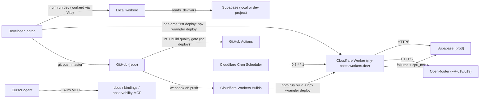

## Cloudflare Workers deployment plan for MyNotes

Ground truth for this plan: `context/foundation/infrastructure.md`. Current wiring — `@astrojs/cloudflare` v13.5.0, `wrangler` v4.90.0, `astro` v6.3.1, `output: "server"`, Cloudflare adapter already installed, `wrangler.jsonc` present with observability enabled, GitHub Actions CI runs lint + build but does not deploy yet.

### Constraints locked in for this pass

1. **Free plan only.** No paid Cloudflare add-ons unless we explicitly hit a Free-tier ceiling. Every phase names the specific Free-tier limit it lives inside; the Paid upgrade is a tripwire, not a default.
2. **Two deploy paths, in order.** (a) A one-time **manual** first deploy from the developer laptop (`npx wrangler deploy`) so we validate the moving parts with eyes on the output. (b) After that, **Cloudflare Workers Builds** (Git-connected) handles every push-to-`master` auto-deploy. **No GitHub Actions deploy job.** The existing `.github/workflows/ci.yml` stays exactly as it is today (lint + build) — a quality gate that is not on the deploy path.
3. **Single environment: production.** No staging / preview environment on Cloudflare. Preview URLs generated by Workers Builds for non-`master` branches are fine (they cost nothing and don't create a distinct wrangler environment), but no `[env.staging]` block in `wrangler.jsonc`, no split secret set, no second worker.

Follow the phases in order. Complete **Prerequisites** first (P.1–P.3), then do not skip Phase 0 or Phase 4 — everything downstream assumes them.

External integrations touched: Cloudflare Workers (deploy target), Cloudflare Workers Builds (Git-driven CI/CD), Supabase (SSR auth, DB), OpenRouter (future FR-018/019 AI runs), GitHub (repo source for Workers Builds; existing Actions keep the lint + build gate), Cloudflare MCP servers (docs / bindings / observability). Each is called out at the point it appears.

---

## Prerequisites (P.1–P.3)

One-time-per-machine and one-time-per-account setup. If your laptop and accounts already have everything from these three subsections, skim the DoD lines and move on. Every sub-step has an explicit source of truth (either the value it produces or the command that verifies it).

Order matters: P.1 (local toolchain) is needed to run the wrangler and supabase CLIs used in P.2 and P.3.

### P.1 — Local toolchain

Everything below runs against the pinned versions in `package.json`. Do **not** install `wrangler` or `supabase` globally — the project ships them as devDependencies so version drift never happens.

- [x] (agent) Confirm **Node.js v22.14.0** (see `.nvmrc`). Verify: `node --version` → prints `v22.14.0` (or a v22.x newer). If missing:
  - macOS / Linux with `nvm`: `nvm install` (auto-reads `.nvmrc`) then `nvm use`.
  - macOS / Linux with `fnm`: `fnm use --install-if-missing`.
  - Any OS with `volta`: `volta install node@22.14.0`.
  - Windows: `nvm-windows` (separate tool from nvm) or `volta`.
- [x] (agent) Confirm **npm ≥ 10** (ships with Node 22). Verify: `npm --version`.
- [x] (agent) `npm ci` from repo root — installs pinned deps including `wrangler ^4.90.0` and `supabase ^2.23.4` as devDependencies. Must complete without errors.
- [x] (agent) Verify **wrangler**: `npx wrangler --version` → prints `4.90.0` or newer.
- [x] (agent) Verify **supabase CLI**: `npx supabase --version` → prints `2.23.4` or newer.
- [x] (agent) Verify **git** is configured: `git config user.email` and `git config user.name` return values. Required for the manual first deploy in Phase 4 (empty-commit workflow) and for Workers Builds' Git-connected mode in Phase 5.
- [ ] (edge case, optional) **Docker Desktop / Docker Engine** — only required if P.3 chooses the local-Supabase branch (`npx supabase start`). Skip if `.dev.vars` will point at a hosted Supabase project.
- [x] (edge case, optional) **`gh` (GitHub CLI)** — helpful for inspecting Actions runs, not required by this plan. Install if you already use it elsewhere.

DoD: `node --version` prints v22.x; `npx wrangler --version` prints; `npx supabase --version` prints; `npm ci` completed without errors.

### P.2 — Cloudflare account & wrangler CLI

- [x] (human) **Create a Cloudflare account** (if none exists) at `https://dash.cloudflare.com/sign-up`. Verify the email link.
- [ ] (human) **Enable 2FA**: dash → My Profile → Authentication → Two-Factor Authentication. TOTP app recommended over SMS. Required practice for any account that will hold Workers Scripts; also a soft requirement if an API token is ever created downstream.
- [ ] (human) **Confirm Free plan**: dash → Workers & Pages → Plan tab. Should say "Free". This is the constraint locked in for this pass — do not upgrade unless a tripwire from Phase 0 fires.
- [x] (human) **Copy the Account ID**: dash sidebar (or Workers & Pages → sidebar) shows a 32-char hex value. Save it in a scratch note. Phase 5 (Workers Builds connect) will reference it; a stray `wrangler deploy` targeting the wrong account is easier to catch when you know the correct ID.

  _Captured 2026-08-11 via `wrangler whoami`: `3d6eb4b04c1ef7942d0bf5059a0fae19` (Account name: `Damian.sordyl@gmail.com's Account`, email `damian.sordyl@gmail.com`)._
- [ ] (human) **Reserve the workers.dev subdomain** by *not* deploying yet. The subdomain is a one-shot per Cloudflare account (format `<name>.<account-slug>.workers.dev`). Phase 4 will claim it interactively. **Suggested name: `my-notes`.** If a `<something>.workers.dev` subdomain is already reserved on this account from prior projects, note the existing slug — you cannot pick a fresh one.
- [x] (human) **Audit account-wide Cron Triggers**: dash → Workers & Pages → open each existing Worker → Triggers tab and tally the cron entries. Free plan cap = **5 crons per account** across all Workers. If already at ≥4, Phase 6's weekly cron will consume the last slot; if at 5, either free one up or skip Phase 6.

  _Audited 2026-08-11 via Cloudflare API (`GET /accounts/{id}/workers/scripts`): **0 Workers on account, 0 crons in use, 5/5 slots free.** Phase 6's weekly cron will land in slot 1/5 with a comfortable margin._
- [x] (human) **Authenticate wrangler locally**: from the repo root run `npx wrangler login`. A browser tab opens → sign in to Cloudflare → "Allow" the OAuth scopes. Credentials land in `~/.wrangler/config/default.toml` on macOS/Linux (`%USERPROFILE%\.wrangler\config\default.toml` on Windows) and stay valid for ~1 year.
- [x] (agent) **Verify wrangler auth**: `npx wrangler whoami`. Should print your email, the Account Name, and the Account ID matching the value you saved.
- [ ] (edge case) If `wrangler login` errors with `Error: Failed to receive the OAuth response`, the local port used for the OAuth callback (default `8976`) is blocked or in use. Retry after freeing the port, or fall back to API-token auth: `wrangler login --api-token` (this plan does not use the API-token path in CI, only for local recovery).
- [ ] (edge case) If your Cloudflare user has access to **multiple accounts** (agency/team setups), `wrangler` picks the first one alphabetically by default. Set `CLOUDFLARE_ACCOUNT_ID=<id>` in your shell profile (or in `.dev.vars` — it's picked up by wrangler) to lock the target account and prevent accidental cross-tenant deploys.
- [ ] (edge case) `wrangler logout` clears the credentials file. Use it before handing the laptop off or when rotating tokens. Re-run `wrangler login` to re-auth.
- [ ] (edge case, optional but recommended) **Enable email notifications** for deploy failures: dash → Notifications → create a "Workers Builds - Deployment failed" notification for the `my-notes` script. This is the fastest way to notice Workers Builds regressions without opening the dash.

DoD: `npx wrangler whoami` returns the correct Account ID; 2FA enabled; workers.dev subdomain choice noted; Free-plan cron budget audited (N of 5 slots used).

### P.3 — Supabase account & project

The codebase already has Supabase SSR auth wired via `@supabase/ssr` (see `src/lib/supabase.ts` and `src/middleware.ts` per `CLAUDE.md`). This subsection is about producing a project with a URL and an anon key that MyNotes can point at, plus configuring Google OAuth for the FR-001-003 login flow.

- [x] (human) **Create a Supabase account** at `https://supabase.com/dashboard/sign-up`. Verify email; enable 2FA (dashboard → Account → Security).
- [x] (human) **Create a new project**: dashboard → New Project. Pick:
  - **Name**: `my-notes` (or `my-notes-prod` if you plan to add a `my-notes-local` later — see the local-Supabase branch below).
  - **Region**: nearest to your users. For PL/EU users: `eu-central-1` (Frankfurt) or `eu-west-2` (London). Region cannot be changed after creation.
  - **Database Password**: generate via a password manager. Save it — resetting later requires a DB reboot and any outstanding connections drop.
  - **Pricing plan**: Free.
- [x] (human) On project provisioning completion (~2 minutes), collect:
  - **Project URL**: Settings → API → Project URL (format `https://<ref>.supabase.co`). This is `SUPABASE_URL`.
  - **anon public key** (a.k.a. **publishable key** in the 2024+ Supabase key format — prefix `sb_publishable_...`): Settings → API Keys. This is `SUPABASE_KEY`. Both the legacy JWT anon key and the new `sb_publishable_...` format are accepted by `@supabase/ssr` ≥ 0.9 and `@supabase/supabase-js` ≥ 2.45 — use whichever the dashboard shows first.
  - **DO NOT collect the `service_role` key** (new format: `sb_secret_...`). It is a full-admin key never intended for the app. `@supabase/ssr` uses only the publishable/anon key. The service_role/secret key belongs only in one-off admin scripts run manually — never in `.dev.vars`, never in `wrangler secret put`, never in a repo secret.

  _Collected 2026-08-11 into `.dev.vars` (root, gitignored): URL `https://fasfewjkbylyobiccoow.supabase.co`, publishable key set. The `sb_secret_...` counterpart was leaked once in chat and rotated at Supabase — never touched by the app._
- [ ] (human) **Enable Google OAuth** (FR-001-003):
  1. Google Cloud Console → APIs & Services → Credentials → Create Credentials → OAuth client ID → application type **Web application**.
  2. **Authorized redirect URI**: paste the exact callback URL shown in Supabase → Authentication → Providers → Google (format `https://<ref>.supabase.co/auth/v1/callback`).
  3. Copy the resulting **Client ID** and **Client Secret** back into Supabase → Authentication → Providers → Google → toggle on → save.
  4. Supabase → Authentication → URL Configuration → **Site URL** = `http://localhost:4321` (local dev is authoritative until Phase 4); **Redirect URLs** = `http://localhost:4321/**` + (after Phase 4) `https://my-notes.<account>.workers.dev/**` + (later) any custom domain. Wildcards are supported.

  _Progress 2026-08-11: sub-bullet 4 (URL Configuration) done — Site URL set to `https://my-notes.damian-sordyl.workers.dev`, Redirect URLs list `http://localhost:4321/**` and `https://my-notes.damian-sordyl.workers.dev/**` (localhost:3000 default removed). Sub-bullets 1–3 (Google Cloud Console OAuth client + Supabase provider toggle) still pending — that's the actual FR-001-003 Google sign-in wiring._
- [ ] (human) **Confirm Supabase Free-tier limits** are acceptable for MVP: 500 MB database, 5 GB egress/mo, 50k monthly active users, 2 free projects per org, 7-day log retention, **project auto-pauses after 7 days of inactivity** on the free tier. For MyNotes MVP scope: fine — but the auto-pause is the surprise most likely to bite (see edge case below).
- [ ] (agent) **Link the Supabase CLI to the project** for the migrations workflow: `npx supabase link --project-ref <ref>`. Prompts for the DB password from the create step. Writes `.temp/` state under the project. Required for `npx supabase db push` and `npx supabase migration new` later.
- [ ] (edge case, optional, local-Supabase branch) If you want fully isolated local dev (recommended for anyone iterating on schema): install Docker Desktop, then `npx supabase start` from repo root. Brings up a full Supabase stack on `http://localhost:54321` with a local anon key printed at startup. Point `.dev.vars` at this local URL + local anon key. Costs ~2 GB RAM, ~30 s cold start; `npx supabase stop` when done. Migrations you write locally can be pushed to the hosted project via `npx supabase db push`.
- [ ] (edge case) If `supabase link` errors with `Cannot resolve project`, verify the `<ref>` matches the URL's subdomain, not the project display name. Format is 20 lowercase alphanumeric chars.
- [ ] (edge case) **Google `redirect_uri_mismatch`** at sign-in: the Google Cloud Console authorized redirect URI must exactly match Supabase's callback URL, character-for-character. Trailing slashes and `http` vs `https` matter.
- [ ] (edge case) **Supabase "Redirect URL not allowed"** at sign-in: the Site URL and Redirect URLs in Supabase → Authentication → URL Configuration must include the exact origin the user is signing in from. Add `https://*.workers.dev/**` if you want to allow every Workers Builds preview URL (relaxes security slightly — acceptable for MVP).
- [ ] (edge case) **Free-tier auto-pause**: if you go quiet for a week, the project pauses and every request 500s until you resume from the dashboard. Set a calendar reminder if you plan to be offline for 5+ days during MVP dev, or push a trivial commit to keep the project warm.
- [ ] (edge case) **Row Level Security**: per `CLAUDE.md`, every new table must have RLS enabled with granular per-operation, per-role policies. This is not a step in this plan but a standing rule for anyone adding tables later. The Phase 6 `ai_run_failures` table will need it.
- [ ] (edge case, human) **Never commit the DB password or any Supabase key to Git.** The anon key's blast radius is bounded by RLS policies, but treat it as a secret regardless. Add nothing to `.env` that isn't already in `.env.example`.

DoD: Supabase project exists; `SUPABASE_URL` and anon `SUPABASE_KEY` are noted in a password manager or scratch note (not in Git); Google OAuth flow configured and tested against the callback URL; Supabase CLI linked (`npx supabase migration list` returns without error).

---

### Legend

- [ ] pending step
- [ ] (agent) safe for an agent to run unattended
- [ ] (human) requires human action (browser click, secret rotation, billing)
- [ ] (edge case) contingent branch — only run if the trigger condition is met
- Every phase ends with a Definition of Done line.

---

### Phase 0 — Project posture & Free-plan tripwires

**Assumes Prerequisites P.1–P.3 are complete.** Everything in Phase 0 is MyNotes-specific — no machine-wide or account-wide setup here.

- [x] (agent) Cross-check that Prerequisites are truly done: `npx wrangler whoami` returns the expected Account ID; `SUPABASE_URL` / `SUPABASE_KEY` values are noted; workers.dev subdomain choice is `my-notes`; Free-plan cron budget audit came back with ≤4/5 slots used. If any of these fail, back up to the relevant Prerequisites subsection.

  _Status 2026-08-11 — all sub-items green_:
  - ✅ `wrangler whoami` verified — Account ID `3d6eb4b04c1ef7942d0bf5059a0fae19`.
  - ✅ `SUPABASE_URL` / `SUPABASE_KEY` collected into `.dev.vars` (root, gitignored) — see P.3 for details.
  - ✅ workers.dev subdomain choice locked as `my-notes` (actual reservation happens interactively in Phase 4).
  - ✅ Free-plan cron budget audit: **0 Workers / 0 crons on the account, 5/5 slots free.**
- [x] (human) **Write down the four Free-plan tripwires** in a place you'll see them again (a scratch note, a comment in `wrangler.jsonc`, or a pinned issue on the repo). Upgrade to Workers Paid ($5/mo) only when one fires:
  - Any single request exceeds **10 ms CPU** (JSON parse of an LLM response, tokenizer, base64 crypto). Measure with `Date.now()` around suspect work.
  - The weekly cron in Phase 6 starts failing with `Script exceeded CPU time limit` in `wrangler tail` / observability MCP.
  - Log retention (3 days on Free vs 7 on Paid) means an incident is invisible on Wednesday. Phase 6 mitigates this by writing failure rows to Supabase — that stays as the primary "did the cron work last Monday?" surface while on Free.
  - Daily requests exceed the Free cap (100 000/day). At MVP traffic (small user base, low QPS) this is not close.

  _Stored as a comment block at the top of `wrangler.jsonc` on 2026-08-11._
- [x] (agent) Confirm the risk-register rows this phase covers (from `context/foundation/infrastructure.md`): "Cloudflare account cron budget silently exhausted" (covered by the P.2 audit); "CPU overrun goes undetected because Free-tier logs retain only 3 days" (mitigated by Phase 6's Supabase failure log).

  _Verified 2026-08-11: both rows present in `context/foundation/infrastructure.md` Risk Register (lines 91 and 94)._

DoD: Prerequisites cross-check passes; four Free-plan tripwires are written down in one specific place; risk-register cross-refs acknowledged.

---

### Phase 1 — Local dev parity (workerd, no `wrangler dev`)

- [x] (agent) Confirm `npm run dev` boots on workerd, not Node. Adapter v13 makes `astro dev` run under Cloudflare's Vite plugin against `workerd`; there is no need for a separate `wrangler dev`. If any doc or tutorial tells you to run both, it predates adapter v13 — ignore.

  _Verified 2026-08-11: boot log emits `[@astrojs/cloudflare] Enabling image processing with Cloudflare Images` and `Enabling sessions with Cloudflare KV` — Cloudflare bindings that only initialize on workerd. Astro v6.3.1 ready in 2.5 s. Note: initial `npm run dev` failed with a broken nested `wrangler` package under `node_modules/@cloudflare/vite-plugin/`; resolved by re-running `npm ci` (the P.1 install step, now genuinely completed on this machine)._
- [x] (agent) Create a **root-level** `.dev.vars` (gitignored by `.gitignore` line 21) containing `SUPABASE_URL=…` and `SUPABASE_KEY=…` pointing at your Supabase project (or a local `npx supabase start` instance). Format is dotenv, one `KEY=value` per line, no quotes required. Do not use `.env` for workerd dev — the Cloudflare Vite plugin only reads `.dev.vars`.

  _Created 2026-08-11 with the values collected in P.3. Boot log confirms `Using secrets defined in .dev.vars`._
- [x] (agent) Smoke test: `npm run dev`, hit `http://localhost:4321`, verify sign-in flow with Supabase works. This is the "close mirror of production" check called out in `context/foundation/infrastructure.md` — problems that only appear in production are much rarer with adapter v13.

  _Partial 2026-08-11 — automated checks green:_
  - _`GET /` → HTTP 200 (53.8 KB, ~2 s cold render)._
  - _`GET /auth/signin` → HTTP 200, title `Sign in`._
  - _`GET /dashboard` (unauth) → HTTP 302 → `/auth/signin` — Supabase-SSR middleware gate working._
  - _End-to-end sign-up + sign-in through the browser: user landed on `/dashboard` — full Supabase auth flow green against `.dev.vars` values._
- [x] (edge case) If Supabase JS throws about missing globals, verify `wrangler.jsonc` still has `"compatibility_flags": ["nodejs_compat"]` — Supabase `@supabase/ssr` depends on it. Already set at `wrangler.jsonc` line 6.

  _Re-verified 2026-08-11: `wrangler.jsonc:6` still has `"compatibility_flags": ["nodejs_compat"]`; no Supabase-related crashes seen during the automated smoke._

DoD: `npm run dev` boots on workerd, Supabase auth roundtrip works locally.

---

### Phase 2 — Harden `wrangler.jsonc` and adapter config (single-env)

Small mechanical fixes to align the scaffold with this project's identity and the adapter v13 contract. Constraint 3 (production-only) is enforced here: **no `[env.*]` blocks**. The top-level config *is* the production config.

- [x] (agent) Rename `"name": "10x-astro-starter"` → `"name": "my-notes"` in `wrangler.jsonc`. The current name leaks the starter identity into the workers.dev subdomain.

  _Renamed 2026-08-11. `package.json` still carries `"name": "10x-astro-starter"` — deploy-inert (npm package name, not exposed to the Worker) but a cosmetic follow-up if desired._
- [x] (agent) Keep `"main": "@astrojs/cloudflare/entrypoints/server"` as-is *for now*. Phase 6 will swap this to `./src/worker.ts` to add the scheduled handler — do it in one atomic change with the cron trigger addition.
- [x] (agent) Confirm `"compatibility_date": "2026-05-08"` is recent enough. If Astro or wrangler emit a warning on next `build`, bump to today's date on a separate commit.

  _Verified 2026-08-11: `npm run build` completed in 4.25 s with zero adapter / wrangler / compatibility warnings._
- [x] (agent) Keep `"observability": { "enabled": true }`. Free plan retains logs 3 days — Phase 6's Supabase failure log is what covers the gap.
- [x] (agent) **Do NOT add an `[env.staging]` or `[env.preview]` block** — we're staying on a single production Worker per constraint 3. Workers Builds will still create preview URLs for non-master branches, but they run against the same top-level config (with the same production secrets bound). That's a deliberate trade: simpler config now, more scaffolding later if a distinct staging environment becomes necessary.

  _Verified 2026-08-11: no `[env.*]` blocks in `wrangler.jsonc`._
- [x] (agent) Note: `context/foundation/tech-stack.md` line 8 says `deployment_target: cloudflare-workers` — correct and authoritative. The older `bootstrap-verification/verification.md` still shows `cloudflare-pages` but is historical (adapter v13 dropped Pages).
- [ ] (edge case) If any new binding (KV, D1, R2, Queues) is introduced later, at that moment `wrangler.jsonc` MUST be committed explicitly — the adapter's auto-generated fallback disappears the moment you declare a binding (risk register: "Wrangler config drift").

DoD: `wrangler.jsonc` name matches the project; existing entrypoint + observability retained; single production config (no env blocks); no adapter warnings on `npm run build`.

---

### Phase 3 — Production secrets in the three right places

The infra doc's operational story pins this down: local `.env` (Node scripts only, largely unused here), local workerd `.dev.vars`, production `wrangler secret put`. Never mix.

- [x] (human) `npx wrangler secret put SUPABASE_URL` — paste the production Supabase URL when prompted.

  _Uploaded 2026-08-11 via `printf '%s' <URL> | npx wrangler secret put SUPABASE_URL`. Wrangler auto-created a placeholder Worker named `my-notes` on Cloudflare (empty script, no routes) because no Worker existed yet — this is Cloudflare's newer behaviour, and it also implicitly reserves the `my-notes.<account>.workers.dev` subdomain. Phase 4 "first deploy" will now just upload code to the existing Worker rather than create it interactively._
- [x] (human) `npx wrangler secret put SUPABASE_KEY` — paste the production Supabase anon key when prompted.

  _Uploaded 2026-08-11 with the publishable key value from `.dev.vars`._
- [x] (agent) Update `.env.example` to list all secrets the app expects (including the future `OPENROUTER_API_KEY`) so contributors know what to fill in. Keep the values as `###` placeholders.

  _`.env.example` now lists SUPABASE_URL, SUPABASE_KEY, OPENROUTER_API_KEY as `###` placeholders._
- [ ] (edge case, human) When FR-018 (weekly AI summary) lands: `npx wrangler secret put OPENROUTER_API_KEY`. astro:env `access: "secret"` values are runtime-only, so `npm run build` should not need it — validate by running `npm run build` locally without the key set. Only add it to the existing GH Actions build env / Workers Builds build env if the build actually fails without it.
- [x] (agent) Verify secrets exist: `npx wrangler secret list`. Should show `SUPABASE_URL` and `SUPABASE_KEY`, values redacted.

  _Verified 2026-08-11: `wrangler secret list` returned both entries with `type: secret_text`, values redacted._
- [x] (edge case) `astro.config.mjs` (lines 19-20) currently marks both Supabase env fields `optional: true`. This lets the build succeed without them, at the cost of hiding a runtime failure. Consider flipping to `optional: false` after this phase so a missing production secret fails at build/deploy time rather than at first request — but note this couples build to secret availability, so both the existing GH Actions build (`.github/workflows/ci.yml` lines 22-24) **and** the Workers Builds build step (Phase 5) must have the env vars set.

  _Decision 2026-08-11: **keep `optional: true`.** Trade-off accepted: build succeeds without secrets present in the build env, at the cost of a first-request runtime failure if production secrets are ever missing. Simpler for now; may revisit after Phase 5 once Workers Builds env is wired. Runtime failures will still surface in `wrangler tail` and the `ai_run_failures` Supabase log (Phase 6)._

DoD: `wrangler secret list` shows both Supabase secrets; `.env.example` is complete; decision recorded on the `optional: true` question.

---

### Phase 4 — First production deploy (manual, from your terminal)

This is the one deploy of the entire lifecycle that happens by hand, per constraint 2. Every deploy after this is auto-triggered by Workers Builds on push to `master`. The point of doing this manual round is to (a) claim the workers.dev subdomain interactively, (b) confirm the app runs on real Cloudflare infra before the automated path takes over, and (c) create the deployment history that rollback needs in Phase 8.

- [x] (agent) `npm run build` — verify a clean production build using `@astrojs/cloudflare`. The build should emit into `dist/` and log the adapter version.

  _Ran 2026-08-11 in ~3.3 s. Server bundle: 1910.57 KiB across 21 modules. Zero adapter/wrangler warnings; only benign `[vite]` inspector-port fallback and `[@astrojs/sitemap]` "site not set" notes._
- [x] (agent) `npx wrangler deploy` — first-run prompts once for the workers.dev subdomain. Note the printed URL.

  _Deployed 2026-08-11. **Live URL: `https://my-notes.damian-sordyl.workers.dev`** — no interactive subdomain prompt (already reserved when Phase 3 created the placeholder Worker). Auto-provisioned resource: **KV Namespace `my-notes-session` (id `961e69ec4a024c9081698dc43e2bd62e`)** to back the `SESSION` binding that `@astrojs/cloudflare` v13 declares for KV-backed sessions. Bindings on live: `SESSION` (KV), `IMAGES`, `ASSETS`. Worker startup: 24 ms._
- [x] (agent) Hit the printed URL, verify: (a) home page renders, (b) `/auth/signin` renders, (c) a real sign-in with Supabase completes and lands on `/dashboard`. The middleware at `src/middleware.ts` is the single gate — if the redirect misbehaves, the deploy is bad regardless of what wrangler says.

  _Verified 2026-08-11:_
  - _`GET /` → 200 (2.3 s cold, 4.7 KB minified — real starter landing page HTML with Tailwind)._
  - _`GET /auth/signin` → 200 (200 ms warm), title `Sign in`._
  - _`GET /dashboard` (unauth) → 302 → `/auth/signin` — Supabase-SSR middleware working with the production `wrangler secret` values._
  - _User confirmed email + password sign-in works on the live URL and lands on `/dashboard`._
  - _Latent gap **resolved 2026-08-11**: Supabase → Authentication → URL Configuration updated — Site URL = `https://my-notes.damian-sordyl.workers.dev`; Redirect URLs = `http://localhost:4321/**` and `https://my-notes.damian-sordyl.workers.dev/**` (localhost:3000 default removed). Magic-link, password-reset, and email-confirmation flows will now redirect to the correct origins; only Google OAuth remains gated by the actual provider setup (P.3 sub-bullets 1–3)._
- [x] (agent) `npx wrangler deployments list` — confirm the version ID and timestamp. This is the rollback target you'll use in Phase 8.

  _Confirmed 2026-08-11. **First deploy Version ID: `5e660c5d-eacf-48c4-a054-a91ab672a961`** (2026-08-11T05:03:45Z). List also shows two prior "Secret Change" version records from Phase 3 — those are also potential rollback targets, though rolling back to a Secret-Change version would revert to the empty placeholder Worker (no code)._
- [x] (agent) `npx wrangler tail --format=pretty` in a separate terminal, exercise the app for ~1 minute, confirm logs flow.

  _Ran 2026-08-11. Tail connected within seconds; all 7 subsequent live requests (5× `/`, 1× `/auth/signin`, 1× `/dashboard`) surfaced in tail output within <1 s of the request. Logs stream cleanly._
- [ ] (edge case) If build fails with a `Node.js built-in module` error (e.g. `fs`, `net`, `child_process`) — some dependency has snuck in a Node-only import. Search with `rg "from ['\"]node:` or check `dist/_worker.js` for `require\(['\"]node:`. Fix by replacing the dep or shimming; do not disable `nodejs_compat` — it's already on but does not shim everything.
- [ ] (edge case) If deploy fails with `Script startup exceeded CPU time limit`, the module-level init (imports + top-level code) is too heavy. Move expensive work into request handlers.

DoD: production URL live, sign-in works, `wrangler deployments list` shows one deployment, `wrangler tail` streams logs cleanly.

---

### Phase 5 — Wire Cloudflare Workers Builds for auto-deploy on `master`

Per constraint 2, auto-deploy is owned by **Cloudflare Workers Builds** — a Git-connected build+deploy service integrated into the Workers dashboard. No `cloudflare/wrangler-action`, no `CLOUDFLARE_API_TOKEN` in GitHub, no deploy job in `.github/workflows/ci.yml`. Cloudflare pulls from GitHub, runs the build, publishes the Worker, and posts preview URLs on non-`master` branches natively.

The existing `.github/workflows/ci.yml` **remains as-is** — it keeps its lint + build role as a quality gate on PRs and on `master`. It is *independent* of the deploy path; a red CI does not block a Workers Builds deploy (that's a known trade-off of this split — noted in the edge cases below).

#### Setup steps

- [x] (human) Cloudflare dash → Workers & Pages → open the `my-notes` Worker (created in Phase 4) → **Settings** → **Builds** → **Connect** → authorize the Cloudflare GitHub App on this repository only (not org-wide). Reference: [Workers Builds docs](https://developers.cloudflare.com/workers/ci-cd/builds/). _Done 2026-08-11: GitHub App installed scoped to `DamSor/myNotes` only._
- [x] (human) In the Builds settings, configure:
  - **Repository**: this repo
  - **Production branch**: `main` (plan predates repo rename from `master`; treat all "master" references in this file as `main` — see revision log)
  - **Build command**: `npm run build`
  - **Deploy command**: `npx wrangler deploy` (Cloudflare's default; make it explicit to avoid drift)
  - **Root directory**: `/` (repo root)
  - **Build environment → Node version**: `22` (matches `.nvmrc`). Do NOT rely on Cloudflare's default — it may lag behind Node 22 which Astro 6 requires.
  - **Build variables**: add `SUPABASE_URL` and `SUPABASE_KEY` **only if** Phase 3 flipped `optional: false` (astro:env `access: "secret"` values are runtime-only, so the build normally does not need them). Do NOT put runtime secrets in Build variables — those are for `wrangler secret put`. _Decision 2026-08-11: not needed — `optional: true` kept in Phase 3, so build works without Supabase env at build time._
- [x] (human) In Builds → **Deploy triggers**, confirm: pushes to `main` → production deploy; pushes to non-`main` branches → preview deploy (ephemeral `<branch>-<script>.workers.dev` URL). Keep both enabled. _Verified 2026-08-11: non-prod branch push produced preview URL as expected._
- [x] (agent) Push a trivial commit to a scratch branch (not `main`), open the PR, confirm:
  1. GitHub Actions' existing `ci` job runs and passes (lint + build). — pass (46s, run 31463239149)
  2. Cloudflare Workers Builds runs on the same commit and produces a preview URL. — pass (build `2bc0a150-10fb-4103-80fc-f7503065182f`, Worker version `v5`)
  3. The Cloudflare GitHub App comments the preview URL on the PR. — pass (comment on PR #1)

  Preview URLs verified live:
  - Commit-specific: `https://46297785-my-notes.damian-sordyl.workers.dev` → HTTP 200
  - Branch-specific: `https://test-workers-builds-smoke-my-notes.damian-sordyl.workers.dev` → HTTP 200
  - Middleware smoke: `/dashboard` → 302 → `/auth/signin` (auth gate works on previews too)
- [x] (agent) Merge the PR to `main`, confirm Workers Builds runs a *production* build+deploy and the workers.dev URL reflects the merged commit within ~1-2 minutes of the merge. _Done 2026-08-11: PR #1 squash-merged as commit `6125ab9`. Workers Builds produced Worker version `v6` at 06:06:55Z and activated it as the production deployment (`2740e603…`) at 06:06:56Z (~60s end-to-end). Production URL returns HTTP 200; `/dashboard` still 302s to `/auth/signin`. Auto-deploy on `main` is verified working._

#### Free-tier build budget

- [ ] (agent) Note the Workers Builds Free tier budget (as of 2026-08: 3000 build minutes/mo, 6 concurrent builds — verify against dash before relying on it). At a solo push cadence this is well within budget; the tripwire fires only if a runaway loop retries on every PR update.
- [ ] (edge case) If Builds gets slow (>3 min per build), check the build log for unnecessary reinstalls (should hit the npm cache). Cloudflare caches `node_modules` between builds keyed on `package-lock.json`.

#### Guardrails and edge cases

- [ ] (agent) **CI is a soft gate**, not a hard gate — Workers Builds does not wait for GitHub Actions to go green. Document this in `AGENTS.md` (Phase 7): "if the CI red-checks a PR, the Workers Builds preview still deploys. Reviewer must gate merge on both, since a merge-with-red-CI will still auto-deploy to production."
- [ ] (edge case) If lint failing is a common enough workflow smell to want a hard gate, the cleanest option is to enable **GitHub branch protection** on `master`: require `ci` job to pass before merge. This keeps deploy ownership in Cloudflare but blocks bad merges upstream. Recommended — trivial to enable, closes the split-gate hole.
- [ ] (edge case) **Fork PRs**: Workers Builds runs the build in Cloudflare (not GH Actions), so it does not depend on GH Actions secret propagation. Fork PRs *do* get preview deploys under Workers Builds — the fork-PR-secret limitation from the GH-Actions path does not apply. Verify once against your first external contributor (unlikely at MVP stage but worth confirming).
- [ ] (edge case) If Workers Builds fails with `Error: You need to provide a Cloudflare account ID`, the GitHub App connection did not attach the account — reconnect via dashboard.
- [ ] (edge case) If Workers Builds succeeds but the site 500s at runtime, the production secrets are missing on the Worker. The build has no visibility into `wrangler secret list` — verify Phase 3 was completed against the same Worker script name (`my-notes`).
- [ ] (edge case) If you later need a "don't deploy this commit" escape hatch, Cloudflare respects `[skip ci]` in the commit message body — same convention as GH Actions.

DoD: A push to `master` deploys automatically via Workers Builds; a push to any other branch produces a preview URL; the existing GH Actions `ci.yml` is unchanged and still runs lint + build; branch protection is enabled on `master` (or the trade-off is explicitly accepted).

---

### Phase 6 — Weekly summary Cron Trigger inside the Free-tier envelope (FR-018 wiring)

The infrastructure doc floats two options: (a) custom Worker entrypoint that re-exports the Astro handler plus a `scheduled()` handler, or (b) a second tiny Worker that calls an internal Astro API route protected by a shared secret. **Option (a) is the primary pattern** — adapter v13 explicitly supports it via a swapped `main` in `wrangler.jsonc`, verified against Astro's v13.0.0 release notes and current [@astrojs/cloudflare docs](https://docs.astro.build/en/guides/integrations-guide/cloudflare/). Option (b) remains available as a decoupling fallback.

**Free-plan CPU budget for the scheduled handler**: 10 ms per invocation. This is the single most important number in the entire plan. Design the handler to stay well under it (target: 3-5 ms of CPU work per user, with I/O to Supabase and OpenRouter *not counting* against the 10 ms wall).

- [ ] (agent) Create `src/worker.ts` with the adapter v13 custom-entrypoint shape:
  - Import `handle` from `@astrojs/cloudflare/handler`
  - Export `default { fetch, scheduled }` — `fetch` delegates to `handle(request, env, ctx)`, `scheduled(controller, env, ctx)` calls the weekly-summary service.
  - Keep the scheduled body minimal for now — `console.log('cron fired', controller.cron)` plus a `Date.now()` delta log — until FR-018 service exists.
- [ ] (agent) In `wrangler.jsonc`, swap `"main": "@astrojs/cloudflare/entrypoints/server"` → `"main": "./src/worker.ts"` AND add `"triggers": { "crons": ["0 3 * * 1"] }` (Mondays 03:00 UTC). Do both together — the custom entrypoint without triggers is dead code; triggers without a scheduled handler are a runtime error.
- [ ] (agent) Local test: with the Cloudflare Vite plugin (which powers `astro dev` in adapter v13), the scheduled handler is invokable at `http://localhost:4321/cdn-cgi/handler/scheduled` — hit it to verify wiring before deploy. Docs: [Cron Triggers · Cloudflare](https://developers.cloudflare.com/workers/configuration/cron-triggers/).
- [ ] (agent) Production test after deploy (Workers Builds picks up the new `main` + `triggers` block on the master merge): verify with `npx wrangler triggers list` or dash → Worker → Triggers. **Do not** run `npx wrangler triggers deploy` — `wrangler deploy` (including the Workers Builds deploy) picks up the `triggers` block automatically.
- [ ] (agent) In the scheduled handler, wrap the body in `try/catch` and on error write an `ai_run_failures` row to Supabase — this is the **primary observability path** on Free tier since Workers logs are gone after 3 days. Include: `cron_expr`, `started_at`, `finished_at`, `cpu_ms` (from `Date.now()` delta), `error_message`, `error_stack`, `users_processed`. Surface the last N failures in the "AI dla mnie" UI per FR-018 visibility guardrail.
- [ ] (agent) **Design the handler to stay under 10 ms CPU on Free tier**. Concrete rules:
  - Loop across users sequentially, `await` OpenRouter per user. I/O wait does not count against CPU.
  - Do not `JSON.parse` LLM responses larger than ~4 KB inline — either stream or chunk. `JSON.parse` counts against CPU.
  - No base64/crypto in the hot loop.
  - If the design can't fit into 10 ms even in isolation, chunk the user list across multiple cron ticks (e.g. process N users per Monday) rather than upgrade to Paid.
- [ ] (edge case) If `wrangler deploy` (or Workers Builds) complains that the custom entrypoint is invalid, verify the `handle` import path — some pre-13 tutorials use `createExports()` which was removed. Only `@astrojs/cloudflare/handler` is valid on v13.
- [ ] (edge case) If the scheduled handler exceeds 10 ms of CPU on Free tier, it fails silently in production — the `ai_run_failures` Supabase row is what you will notice. Two mitigations, in order of preference: (i) shrink the handler until it fits, (ii) only then consider Paid ($5/mo, per the tripwires in Phase 0).
- [ ] (edge case) After adding this cron, the account-wide cron budget goes from N → N+1 out of 5 on Free. If the Phase 0 audit showed you're at 4/5, this is the last slot.
- [ ] (edge case) Workers Builds deploys the scheduled handler exactly like a fetch-only Worker — no special config needed. If the trigger *seems* to work locally but never fires in production, check dash → Worker → Triggers first; a missing entry there means the deploy did not pick up the `triggers` block (usually because someone `wrangler deploy`'d from a stale checkout).

DoD: `wrangler triggers list` shows `0 3 * * 1`; the scheduled handler logs a heartbeat next Monday at 03:00 UTC (or immediately if you use the `/cdn-cgi/handler/scheduled` endpoint locally); the `ai_run_failures` Supabase table exists and is written to on error.

---

### Phase 7 — Observability & safeguards

Cheap, one-time hardening that catches the failure shapes in the risk register before they bite.

- [ ] (agent) Connect the three Cloudflare MCP servers from Cursor (Settings → MCP → Add server, OAuth flow):
  - `https://docs.mcp.cloudflare.com/mcp` — searchable docs
  - `https://bindings.mcp.cloudflare.com/mcp` — KV/D1/R2 management
  - `https://observability.mcp.cloudflare.com/mcp` — typed log queries (`query_worker_observability`)
- [ ] (agent) Add an ESLint rule to catch Node-only imports that will silently break the Worker build. Extend `eslint.config.js` with `no-restricted-imports` blocking `fs`, `net`, `child_process`, and `node:*` prefixes in `src/**` (allow-list workarounds in a comment). Risk register: "Node-only dependency inadvertently added".
- [ ] (agent) Add a "Deployment" section to `AGENTS.md` capturing:
  - **Deploy path**: pushes to `master` are auto-deployed by **Cloudflare Workers Builds** (Git-connected). GitHub Actions runs lint + build as a quality gate but does NOT deploy. Never add a deploy job to `.github/workflows/ci.yml` without explicit approval.
  - **Branch protection**: `master` requires the `ci` job to pass before merge (Phase 5 setup) — this closes the "red CI still deploys" hole.
  - **Free-plan posture**: currently on Cloudflare Free. The 10 ms CPU cap on the weekly cron is the primary constraint. Tripwires for upgrading to Paid live in `context/foundation/infrastructure.md` and Phase 0 of the deploy plan.
  - `astro dev` runs on workerd, do not run `wrangler dev` alongside.
  - Secrets live in `.dev.vars` (local) and `wrangler secret put` (production) — never in `wrangler.jsonc`, never in Workers Builds "Build variables" (those are build-time only).
  - Astro 6 removes `Astro.locals.runtime.env`; use `import { env } from 'cloudflare:workers'` if you ever need direct binding access (current code uses `astro:env/server` which is fine).
  - The account-wide 5-cron cap on Free tier (per Cloudflare account, not per Worker).
- [ ] (agent) Add a lesson to `context/foundation/lessons.md` (create if absent) warning: **"Any pre-2026 Cloudflare Pages guidance is stale for this project. Astro 6 / adapter v13 dropped Pages support; the deployment target is Cloudflare Workers only."** Risk register: "Stale docs mislead future agents".
- [ ] (edge case) If you cannot OAuth-connect the observability MCP (corporate network / older MCP host), fall back to `wrangler tail` in a shell + `npx wrangler deployments list` for CLI-only ops. Both are documented in `context/foundation/infrastructure.md` under Operational Story → Logs. Workers Builds build logs are viewable in the dash → Worker → Builds tab (not currently exposed via MCP as of 2026-08).

DoD: MCP servers connected (or fallback documented); ESLint blocks Node-only imports; `AGENTS.md` deployment section merged; lessons file updated.

---

### Phase 8 — Rollback drill & verification

Do this once with a real (safe) diff so you know the muscle memory before you need it.

- [ ] (agent) Make a trivial, safe change (e.g. add a comment in a `.astro` file), merge to `master`, let **Workers Builds** deploy it. Confirm the URL reflects the change (usually within 1-2 min of merge).
- [ ] (agent) `npx wrangler rollback --message="drill: rollback verification"` — reverts to the previous version pointer. Confirm the URL reflects the prior commit within seconds (no rebuild, just a pointer flip).
- [ ] (agent) Roll forward: `npx wrangler deployments list`, pick the newer version ID, run `npx wrangler rollback <version-id>` to re-promote. (Alternatively, push an empty commit to `master` to have Workers Builds redeploy — takes longer but works.)
- [ ] (agent) Write a 3-line runbook in `AGENTS.md` "Deployment" section referencing the exact commands. Time-to-revert via `wrangler rollback` should be measured (should be under 10 seconds in practice).
- [ ] (edge case, human) **Rollback does not revert Supabase migrations** — if the reverted Worker version depended on the *previous* schema and the intervening deploy applied a migration, you need a *forward* migration to restore the prior schema shape. Cited in `context/foundation/infrastructure.md` under Operational Story → Rollback. Document this in the runbook explicitly.
- [ ] (edge case, human) **Workers Builds does not know you rolled back.** After a `wrangler rollback`, the next push to `master` will still build from `HEAD` and re-deploy the buggy commit. If you rollback for a real incident, either revert the offending commit in Git *before* the next push, or pause the Workers Builds trigger in the dash until the fix lands.
- [ ] (edge case) If the rollback CLI errors with "no previous deployment", the account has only one deployment on record — deploy at least twice before drilling. Phase 4 (manual first deploy) + one Workers Builds deploy from Phase 5 = the minimum two deployments needed.

DoD: You have rolled a real change back and forward, and the runbook is on disk.

---

### Deferred / follow-ups

- The prompt at `.cursor/prompts/m1l5-2-constrain-approach.md` — "ensure auto-deploy on master is handled by Cloudflare, not external CI/CD" — **is satisfied by this plan's Phase 5** (Workers Builds owns the deploy; GH Actions stays as lint + build only).
- The prompt at `.cursor/prompts/m1l5-3-extend-prerequisites.md` will extend this plan with CLI-configuration prerequisites (wrangler + gh + any MCP config).
- **Paid-tier upgrade** ($5/mo Workers Paid) is intentionally deferred until one of the Phase 0 tripwires fires. Do not upgrade prophylactically.

### Architecture at a glance

